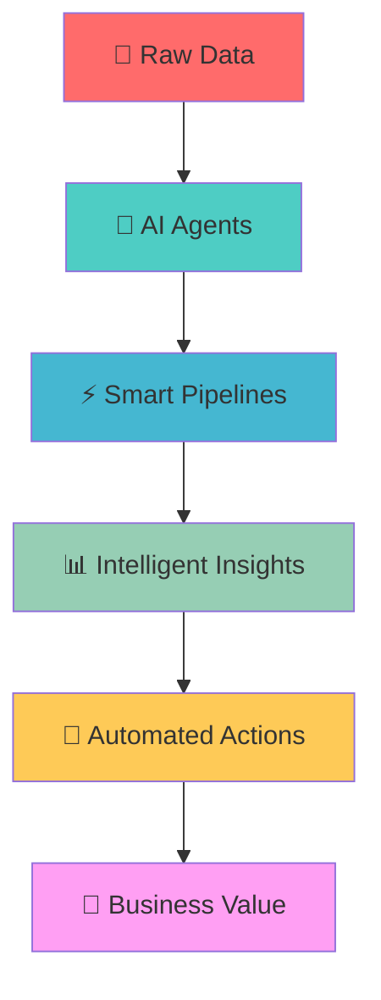

# 🚀 Welcome to My Github Profile 

<div align="center">
  
## 🤖 Passionate Data Engineer | AI Agent Architect | GenAI Enthusiast

*"Building the future, one intelligent agent at a time"*

[](https://git.io/typing-svg)

</div>

---

## 🌟 About Me

I'm a passionate **Data Engineer** who lives and breathes the intersection of **big data** and **artificial intelligence**. Currently focused on building cutting-edge **AI agents** and **intelligent tools** that transform how we interact with data and automate complex workflows.

🔭 **Currently Building:** Revolutionary AI agents and tools that push the boundaries of automation  
🌱 **Always Learning:** Latest in GenAI, LLMs, and distributed computing  
⚡ **Fun Fact:** I love turning complex data challenges into elegant solutions that empower businesses 

---

## 🛠️ Tech Arsenal

### 🏗️ Data Engineering Powerhouse

<div align="center">

#### **Orchestration & Workflow**


#### **Big Data Processing**


#### **Data Warehousing & Lakes**


#### **Databases & Storage**


#### **ETL/ELT Tools**


</div>

### 🤖 AI Agent & Tool Development

<div align="center">

#### **AI Agent Frameworks**


#### **LLM & AI Platforms**


#### **Vector Databases & RAG**


#### **MLOps & Model Deployment**


</div>

### 💻 Programming Languages & Core Tech

<div align="center">


</div>

### ☁️ Cloud & Infrastructure

<div align="center">

#### **Cloud Platforms**


#### **Containerization & Orchestration**


#### **Infrastructure as Code**


</div>

---

## 📊 GitHub Analytics

<div align="center">
  


</div>

---

## 🎯 Current Focus Areas

```python
class DataEngineer:
    def __init__(self):
        self.current_projects = [
            "🤖 Multi-Agent RAG Systems",
            "⚡ Real-time Data Streaming with AI",
            "🧠 LLM-powered Data Quality Agents",
            "🔄 Autonomous ETL Orchestration",
            "📊 AI-driven Data Discovery Tools"
        ]
        
    def build_future(self):
        while True:
            self.learn_new_tech()
            self.create_ai_agents()
            self.optimize_data_pipelines()
            self.push_boundaries()
```

---

## 🌐 Connect & Collaborate

<div align="center">

[](https://linkedin.com/in/akshatbindal)
[](https://twitter.com/akshatbindal)
[](https://medium.com/@akshatbindal)
[](mailto:akshatbindal01@gmail.com)

</div>

---

## 💫 Philosophy

> *"In the age of AI, data engineers are the architects of intelligence. We don't just move data—we create the neural pathways of digital consciousness."*

<div align="center">

### 🎨 The Art of Data Engineering



</div>

---

<div align="center">

### 🌈 "Building tomorrow's intelligence, today"

*Let's connect and build the future of AI-powered data engineering together!*

---

⭐ *If you find my work interesting, consider giving my repositories a star!*

</div>
